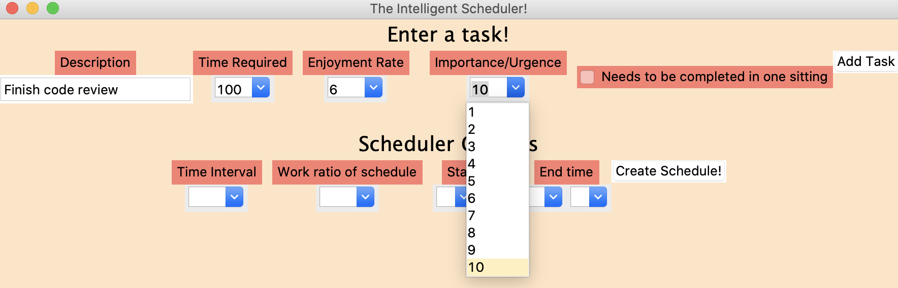

# Intelligent Daily Planner

The intelligent daily planner uses artificial intelligence to help you create better daily schedules! The intelligent daily planner takes multiple factors into account such as how important a task is, how long it will take, and how much the user enjoy completing this task. The users can also customize the intervals of the schedule and how often the schedule should contain breaks. 

## Technologies

The packages used in this project : 
- tkinter
- pandas

## Usage and Illustrations

The following window pops up when you run the User_Input_Interface.py file:

To enter a task, 5 parameters needs to be entered: the description of the task, the estimated time required to finish the task, how much the user enjoys doing this task, the importance/urgence of this task and whether this task needs to be completed in one sitting. The enjoyment and importance/urgence values usually should be between 1 and 10 even though the interface allows higher or lower values. For example, if a task is extremely important, an importance value of more than 10 can be preferred. 

If the user wants to run for 60 minute straight, but the interval is defined to be 20 minutes, the user should check the "needs to be completed in one sitting box" to encourage the intelligent scheduler to schedule a 60 minute consecutive period of running. 

When the user hits the "Add Task" button, the task appears at the bottom of the menu. This means that the task has successfully been added. If the task does not appear after the button has been clicked, the user should make sure that they have not entered non-numerical characters to a drop down box that expected a number.

After the addition of multiple tasks, the window should look like this:

After the user has entered all the tasks they would like to include in the schedule, they can move on to adjusting the scheduler options: time interval, work ratio of schedule, start time, and end time. The time interval determines how many minutes each task slot in the schedule will represent. The work ratio of schedule lets the user customize how many break intervals they would like to have in the schedule. The start and end time will determine when the schedule will start and end. 

When the user is done adjusting the scheduler options, they can click the "Create Schedule!" button, which will create a window demonstrating the best schedules.

The user can save the schedule or schedules that they like by clicking on the "Save Schedule" button located under each schedule. The schedule will be saved in the main directory as a csv file, and then can be further customized.

